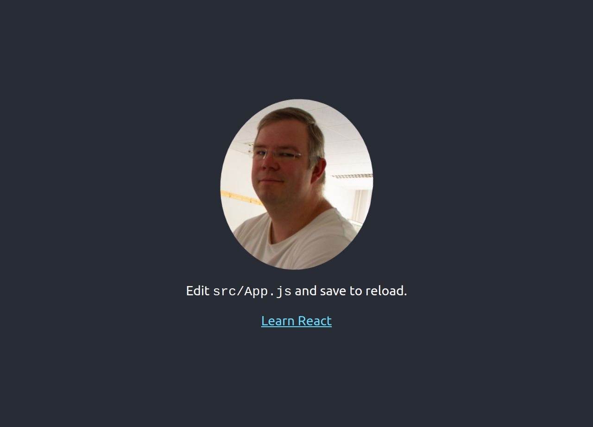

# react-gettingstarted

This page was created by Stefan Klinkusch at Digital Career Institute in Berlin, Germany using React.js.

## Steps
- started a React project using `npx create-react-app getting-started`
- transferred the logo to a different class
- changed the logo (different image)
- styled the logo

## Screenshot

